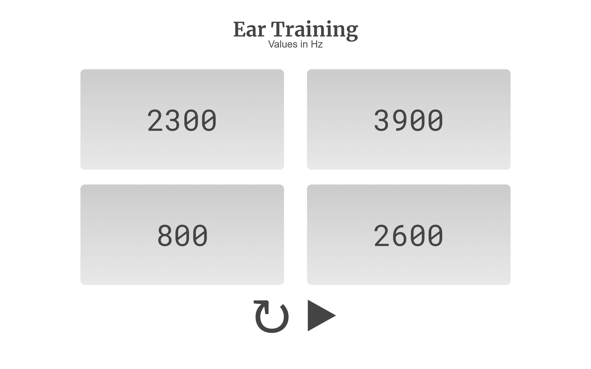

# ear-training

ear-training randomly choose a frequency between 100Hz and 5000HZ. Find the right one among 4 choices.



## Installing

Install dependencies:

```$ npm install```

Build the app and start the server with `parcel`:

`$ parcel index.html`
